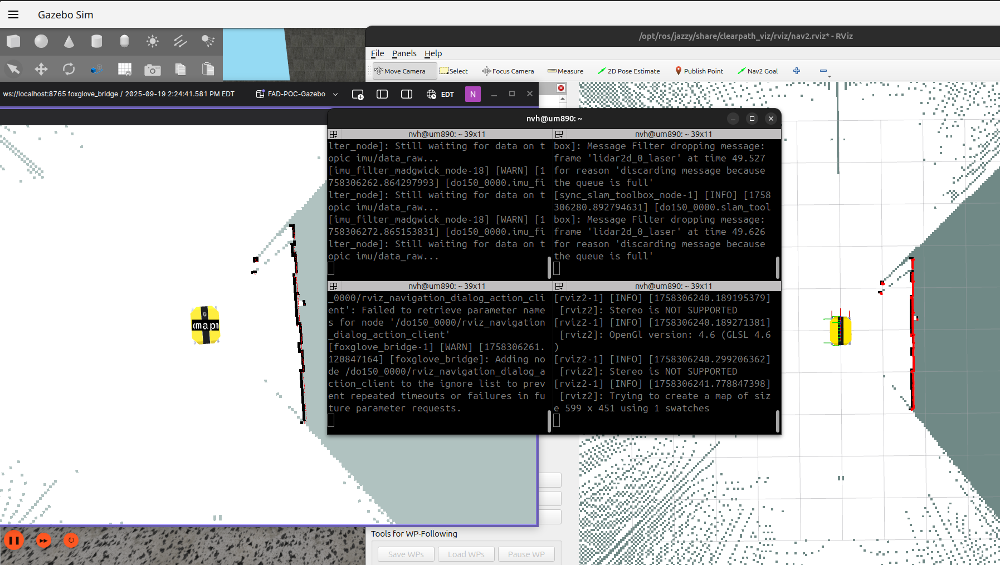

# Fully Autonomous Dingo

This repo is dedicated to work on a fully autonomous workflow for the Dingo-O in ROS2.


## Basic use of the Clearpath NAV2 Demo

The purpose of this is to provide a configuration for the Dingo-O that works with the NAV2 demo and then add some additional instructions to help you get going the first time. 

At the moment I have attached a configuration "robot.yaml" to use with the Clearpath NAV2 demo:

https://docs.clearpathrobotics.com/docs/ros/tutorials/navigation_demos/overview

Please follow the instructions on the documentation above to download the necessary packages. Then to download the Dingo configuration:

```bash
git clone https://github.com/nvanheyst/FAD_POC.git
```


If you are having issues with networking you can use the following command to generate a setup.bash file but it's also recommended to remove any ROS2 networking lines from your ~/.bashrc. 

```bash
ros2 run clearpath_generator_common generate_bash -s ~/FAD_POC
```

Make sure that your ROS2 networking is setup properly:

```bash
source ~/FAD_POC/setup.bash #or add to ~/.bashrc
```

## How to start NAV2 Slam Toolbox Slam Demo

Terminal 1:

```bash
source ~/FAD_POC/setup.bash
ros2 launch clearpath_gz simulation.launch.py setup_path:=$HOME/FAD_POC
```

Terminal 2: 
```bash
source ~/FAD_POC/setup.bash
ros2 launch clearpath_nav2_demos slam.launch.py use_sim_time:=true setup_path:=$HOME/FAD_POC
```

Terminal 3: (RVIZ Option)
```bash
source ~/FAD_POC/setup.bash
ros2 launch clearpath_viz view_navigation.launch.py namespace:=do150_0000 use_sim_time:=true
```

Terminal 3 (Foxglove alternative)
```bash
source ~/FAD_POC/setup.bash
ros2 launch foxglove_bridge foxglove_bridge_launch.xml 
```

This how it should look (although Foxglove and RVIZ are alternatives):


